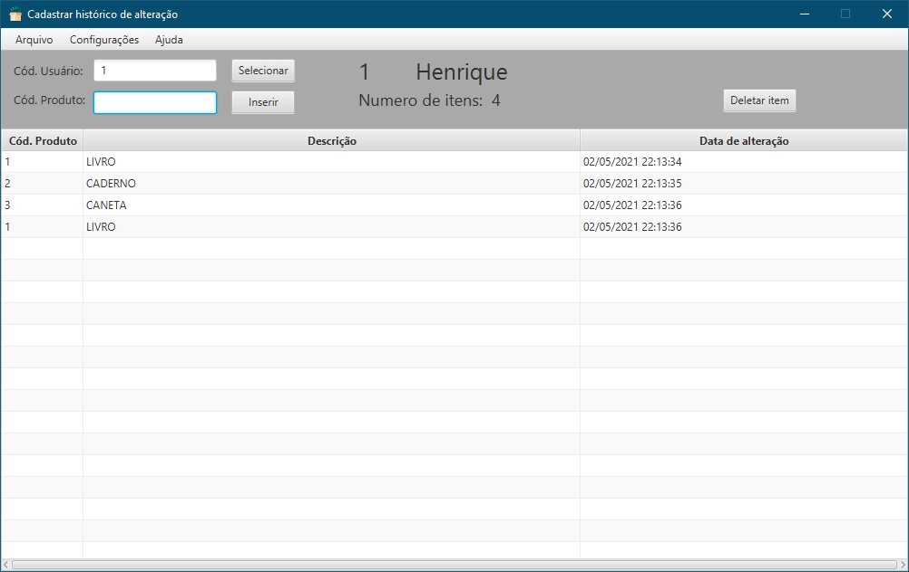
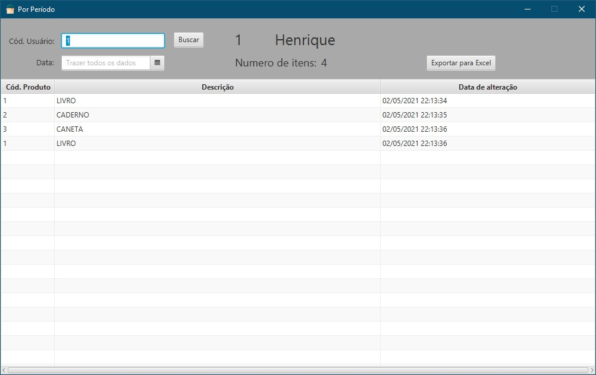
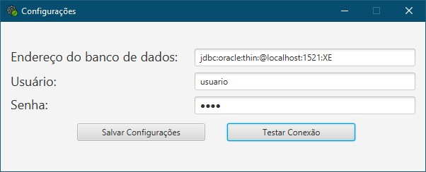

# Winthor - Histórico de produtos
Esse programa foi desenvolvido por mim ao surgir a necessidade de guardar alterações de produtos. 
Ele se comunica com o Winthor apenas para buscar o nome do usuário e o produto. 
Nele é possivel exportar uma planilha excel para acompanhar os dados feitos. 
No menu de configurações é possível adicionar o endereço do banco, usuario e senha. 
Usei JDBC para se comunicar com winthor e Hibernate para persistir o historico (SQLite)  

